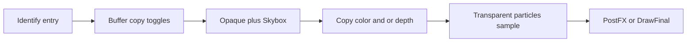

# Particles（Color / Depth Texture）

Unlit 粒子特效依赖的 **Color / Depth Texture**、片元深度、Near Fade / Soft Particles / Flipbook / Distortion。字段 / 类名 / keyword 以**当前项目命名 / 源码为准**。

接线状态见主 Skill §6（**先识别入口**，再分层 grep；**勿断言**某仓已接或未接）。

通用透明合批 / Instancing → [draw-calls.md](draw-calls.md)。中间 RT Store / 默认勿拷 Depth·Opaque → [mobile-perf.md](mobile-perf.md)。多相机 Present / viewport → [multiple-cameras.md](multiple-cameras.md)。

## 1. 先识别入口

| 线索 | 可能入口 |
|------|----------|
| Soft Particles / Distortion / Camera Opaque·Depth Texture 开关（URP） | URP Renderer / Camera |
| Soft Particles 勾选 + Built-in 粒子材质 | Built-in RP（管线侧深度纹理） |
| Camera Buffer Settings（copyColor / copyDepth）+ Particles Unlit + Fragment 采样 | 自建 / Custom SRP |
| 仅 ParticleSystem、无 depth/color 采样、无 soft/distortion keyword | **该项目无粒子缓冲纹理入口（正常）**；仍可画不透明/普通透明粒子 |

未识别前**不要**假设存在 `_CameraDepthTexture` / `CopyAttachments` / 某套固定类名。跨项目第一步是上表，不是 grep 固定符号名。

## 2. 怎么用（通用）

1. 找到项目的 copy depth / copy color / Opaque·Depth Texture 开关（若 §1 判定无入口则停止）。
2. 确认粒子材质走**本管线** Unlit（或 Particles）Shader，而非 Built-in Standard。
3. Game 视图：近相机淡出、与不透明相交软边、Distortion 折射；排除 Preview / Reflection（若管线对反射关 copy）。
4. Frame Debugger：opaque（+ skybox）之后是否出现 depth/color **copy**；透明粒子 Pass 是否绑定 depth/color 纹理。

## 3. 通用概念（非单一实现）

### 3.1 为何需要缓冲纹理

- **Soft Particles**：片元深度 vs **已画不透明**的缓冲深度 → 相交处淡出，隐藏 billboard 硬切。
- **Distortion / 折射感**：按法线/扭曲图偏移 UV，采样 **已画不透明** 的颜色缓冲（透明未计入，粒子互擦会「抹掉」先前透明）。
- **Near Fade**：只靠当前片元 view 深度，**不**需要 depth texture；但常与 soft 同开。

### 3.2 片元深度（透视 vs 正交）

| 投影 | 片元 view 深度来源（常见） |
|------|---------------------------|
| Perspective | `SV_POSITION.w`（透视除法前的 view 深度） |
| Orthographic | 原始 depth 缓冲值线性化（`unity_OrthoParams.w == 1`）；近远平面来自 `_ProjectionParams` |

缓冲深度采样后：正交同样线性化；透视常用 `LinearEyeDepth(raw, _ZBufferParams)`（名以项目 / Core 库为准）。

### 3.3 附件分离与拷贝时机

- Color 与 Depth 在 GPU 上本就是独立 attachment；要**同时画又采样**时，须另有一份 **copy**（不能在同一 target 上边写边采）。
- 常见时机：**Opaque + Skybox 之后**、Transparent **之前**拷贝 → 透明（含粒子）可读；不透明阶段采到的是 missing / 过期纹理。
- 无 Post FX 时若仍要 depth/color texture，常需**中间帧缓冲** + 最终 Present（Copy / DrawFinal）；仅 Post FX 开中间 RT 不够。
- `CopyTexture` 高效；WebGL 2 等可能不支持 → 回退全屏 Copy / CopyDepth Pass，并**恢复**原 color+depth render target。

### 3.4 Shader 能力（粒子 Unlit 常见）

| 能力 | 要点 |
|------|------|
| Vertex Colors | `COLOR` 语义；keyword 控制，避免非粒子网格白费插值 |
| Flipbook Blending | `TEXCOORD0` 为 float4（两套 UV）；`TEXCOORD1` 为 blend；二次采样 base（及 distortion）后 lerp |
| Near Fade | `(depth - distance) / range` 饱和后乘 alpha |
| Soft Particles | `(bufferDepth - depth - distance) / range` 饱和后乘 alpha |
| Distortion | 采样 distortion 图 → decode 为 XY 偏移 × strength × alpha；`lerp(bufferColor, base, saturate(alpha - blend))` |

粒子多为动态 → 常**省略 Meta Pass**。Billboard 合批靠粒子系统合并网格；GPU Instancing 对粒子系统 procedural 路径通常不适用（以引擎为准）。

### 3.5 配置分层（常见）

- **管线 Asset**：全局是否允许 copyColor / copyDepth（反射相机常另开，默认关——反射无粒子且无 Post FX 时拷贝贵）。
- **每相机 Settings**：与 Asset 同时开启才真正拷贝（类似 HDR：Asset × Camera）。
- 未接线时：绑定 1×1 **Missing** 纹理，避免随机旧 RT；Frame Debugger 里名含 Missing 即误采。

概念流（Custom 风格示意，非唯一）：



## 4. 排障（通用）

| 现象 | 查 |
|------|-----|
| Soft 无效 / 硬切边 | copy depth 是否 Asset+相机都开？是否 opaque 后才 copy？材质 soft keyword？ |
| Distortion 黑块 / 闪旧帧 | copy color 是否开？未接线是否绑 Missing？是否在透明阶段采样？ |
| Distortion 抹掉其它透明 | 预期：color copy 不含透明；降 strength / blend 或画序 |
| Near Fade 正交异常 | 是否走正交线性化而非 `.w`？ |
| 无 Post FX 时 soft 全坏 | 是否仍建了中间缓冲 + Present？仅 Post FX 路径有 depth attachment 不够 |
| WebGL 深度全错 | `CopyTexture` 是否回退 Draw CopyDepth？拷完是否恢复 RT？ |
| Flipbook 跳帧 / 报 stream 不匹配 | Renderer Custom Vertex Streams：UV2 + AnimBlend；shader 是否消费 `_FLIPBOOK_BLENDING` |
| 顶点色不变 | keyword / 粒子 Start Color / 是否按距离 Sort |
| Gizmos 穿插错误 | 中间缓冲时 Pre/Post FX gizmos 前是否把 depth 拷回 CameraTarget |
| 反射探针里粒子怪 / 贵 | 反射是否误开 copyDepth/Color；粒子是否本就不进反射 |

## 5. 分层 rg

```bash
# 层 1：通用（跨项目先跑；禁止路径/场景名/菜单名）
rg -n "CameraDepthTexture|CameraOpaqueTexture|_CameraDepthTexture|_CameraColorTexture|SoftParticles|softParticles|copyDepth|copyColor|CopyTexture|LinearEyeDepth|unity_OrthoParams"

# 层 2：仅当项目像本管线风格时再查（候选，非跨项目必存在）
rg -n "CameraBufferSettings|CopyAttachments|Fragment\.hlsl|GetFragment|GetBufferColor|_NEAR_FADE|_SOFT_PARTICLES|_FLIPBOOK_BLENDING|_DISTORTION|_VERTEX_COLORS|DrawFinal|CameraRendererPasses"
```

- 层 2 未命中 ≠ 无粒子（URP 用 Camera Opaque/Depth Texture 即可）。
- 层 2 为 Custom / **候选**；命中也不等于必须按固定类名实现。

## 6. 验收 checklist（通用）

- [ ] 已识别入口（含「无 soft/distortion 入口」），未假设固定类名
- [ ] Soft / Distortion 用「opaque 后 copy → 透明采样」描述；具体 ID 以项目为准
- [ ] 分层 rg：先层 1，仅在像 本管线风格时才层 2
- [ ] 无 Post FX 场景若开 copy，确认中间缓冲 + Present；反射默认勿强开 copy
- [ ] Flipbook：streams 与 shader keyword 一致；Near Fade 与 Soft 可分开开关验证

## 7. 与其它主题边界

- 透明队列 / Batcher / 粒子 Instancing 限制 → [draw-calls.md](draw-calls.md)
- 默认勿拷 Depth/Opaque、Store → [mobile-perf.md](mobile-perf.md)
- 无 Post FX 的 Present / viewport / final blend → [multiple-cameras.md](multiple-cameras.md)
- Render Scale ≠1 时 Distortion/Soft UV → [render-scale.md](render-scale.md)（缓冲尺寸向量，勿死用 `_ScreenParams`）
- Lit 粒子：同缓冲与 fade 逻辑，仅多光照属性——仍以本篇缓冲约定为准，光照 → [directional-lights.md](directional-lights.md)

