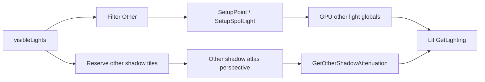

# Point and Spot Shadows

Other Lights（Point / Spot）实时阴影：第二 atlas、透视投影、tile 预算。字段 / 上限 / atlas 以 **OtherShadows**（或旧单体 Shadows）+ Shadows HLSL + ShadowSettings **当前工程 grep** 为准。

**顺序与 Cleanup 只引用主 Skill §3**。阴影必须在相机 color Setup 冲掉 target 之前画完。

结构演进：单体 Shadows → 专类 `OtherShadows`（[unity-upgrades §7.1](unity-upgrades.md)）→ 专 Pass `OtherShadowsPass`（[§7.2](unity-upgrades.md)）。接线见主 Skill §6；**勿断言**某仓已接。

## 怎么用

1. 确认 Pipeline Asset；用工程内 Point/Spot 阴影验证场景或内容（有则用）。
2. Asset → Shadows：除 directional 外，查是否有 **other** atlas / filter（字段名以工程为准）。
3. 灯：Shadow Type≠None、Strength>0；Spot / Point 分别验锥内影与全向影。
4. 验：Frame Debugger 是否出现 other shadow atlas；关灯影消；缩 `maxDistance` 时 other 影与方向光影一并淡出（若全局 strength 共用）。

| 期望（接线后） | 概念 |
|----------------|------|
| Spot 锥内地面投影 | 透视 shadow map，通常 **1 tile / 灯** |
| Point 全向影 | 立方体面，通常 **6 tile / 灯** |
| 软影 | Other 侧 PCF（keyword 以工程为准，常见 `_OTHER_PCF*`） |
| 混合烘焙影 | `GetOtherShadowAttenuation` 与 baked / mask 混合（若已接 mask） |
| Clip / 透明更实心影 | Cast Shadows = Two Sided（可选验证） |

数据路径（概念）：



某一仓库是否已接 Other 直接光 / Other 阴影，一律主 Skill §6 grep。

## Agent 规范

### 复用（必须）

- **同一 ShadowCaster Pass**：Point/Spot 与 Directional 共用投射 pass；不为 Other 新建 ShadowCaster 变体，除非源码已分。
- **复用方向光阴影的 atlas 采样 / bias / tile 框架**：Other 是**第二套 atlas + 透视投影**差异，不是独立阴影管线。
- **复用 attenuation 结构**：若已有 `GetDirectionalShadowAttenuation`，Other 应对齐同级 `GetOtherShadowAttenuation`（同 bias / PCF 风格，只换投影与 tile 来源）；**cascade-blend 不适用于 Other**。
- **复用 Shadows.Render 生命周期**：reserve / cleanup 挂在同一 `Shadows.Render`；不新增独立 RendererList 阶段，除非源码已分。
- **第二 atlas Store Action**：对齐现有 atlas 的 Store / DontCare / Discard（见 [mobile-perf.md](mobile-perf.md)）。

### 其它

- 改阴影：Shadows C# + ShadowSettings（含 other）+ Shadows HLSL + 共用 ShadowCaster；Unity 6 用 `CreateShadowRendererList`，禁止已弃用 `DrawShadows`。
- **Pancaking**：正交方向光可用；透视 Other 光应关闭（常见 `_ShadowPancaking`），否则近裁剪会严重扭曲。
- Tile：Spot 通常 +1；Point 通常 +6；上限以本仓库 `maxShadowedOtherLightCount` / `MAX_SHADOWED_OTHER_LIGHT_COUNT`（或等价）为准——**未接线则勿报运行时上限**。
- 采样：透视需 `positionSTS.xyz / w`；tile 边缘常需 clamp；Point 用面 ID（常见 `CubeMapFaceID`）选 tile。
- 点光漏光 / 背面：Unity 点光矩阵常翻转 winding；可用 view 矩阵行取反恢复 front-face（概念，非强制符号名）。
- 目标符号（`RenderOtherShadows`、`_OtherShadowAtlas`、`_OTHER_PCF*`、`ComputeSpotShadowMatricesAndCullingPrimitives`、`CubeMapFaceID`、`_ShadowPancaking` 等）**仅作概念指代**；禁止写成已实现步骤，除非 grep 命中。
- 禁止把第二 atlas 写成「必须新建独立 RT 管线」。
- 不展开世界→atlas 矩阵公式，除非用户要求。

### Agent 口径（硬）

- 「有 Point/Spot 为何无实时影」→ 先 grep other shadow atlas / attenuation；直接光与阴影常分开接线。
- 「和 Directional 阴影啥区别」→ CSM/正交 vs 透视 tile；Point 多面 tile、无 cascade；**共用 ShadowCaster**，但 atlas / tile 分配 / 投影矩阵不同。
- 「最多几盏带影 Point」→ 以本仓库 shadowed-other 上限与 tile 分配逻辑为准（Point≈6、Spot≈1）；未接线勿报运行时上限。
- 「要不要新建一套阴影管线」→ 否；复用同一 ShadowCaster + Shadows.Render + bias/PCF/tile 框架，仅加第二 atlas 与透视差异。

## 技巧 / 排障

| 现象 | 查 |
|------|-----|
| 有光无 other 影 | Type/Strength；Reserve / atlas grep；bounds；maxDistance；顺序 §3；接影关键字 |
| 有方向影无 Spot/Point 影 | Other atlas 是否渲染/绑定；tile 是否用尽；是否误走方向光路径 |
| tile 边缘串影 | tile clamp / border；Spot FOV 与 tile 贴合 |
| 点光面缝 / 漏光 | FOV bias；view 翻转；Normal Bias；Two Sided |
| acne 随距离变 | 透视 texel 随距放大 → 按到光平面距离缩放 normal bias |
| 长物体近光扭曲 | pancaking 未关 |

对照：单 Spot Hard → 多 Spot 填 atlas → 单 Point（6 tile）→ PCF → 关接影 / Two Sided。

## 相关核对

符号名为常见命名，以本仓库为准：

```bash
rg -n "ReserveOtherShadows|RenderOtherShadows|_OtherShadowAtlas|_OTHER_PCF"
rg -n "GetOtherShadowAttenuation|ShadowPancaking|CubeMapFaceID"
rg -n "SetupPointLight|SetupSpotLight|MAX_OTHER_LIGHT_COUNT|MAX_SHADOWED_OTHER"
rg -n "CreateShadowRendererList|DrawShadows"
```

未命中 other shadow 相关符号 → 勿声称 Other 实时阴影已接线。整帧无 other 阴影灯时可能绑 dummy / 复用方向光 atlas（以源码为准）。

## 验收

- [ ] 接线后：Spot / Point Hard 影可见；关灯影消
- [ ] tile 预算与源码分配一致（Spot 1、Point 6）；超限行为可解释
- [ ] PCF / bias / pancaking 行为与排障表一致
- [ ] 未另起独立 ShadowCaster / 独立阴影 Render 阶段（除非源码已分）
- [ ] 未在相机 Setup 之后才画阴影
- [ ] 未把未实现符号冒充已实现（grep 未命中时）
