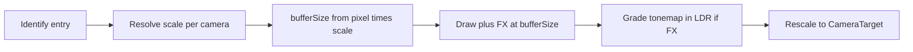

# Render Scale

把**渲染分辨率**与**最终目标缓冲尺寸**解耦：中间 Pass（几何 / 光影 / 粒子 / Post FX）可按缩放缓冲画，最后再缩放到 `Camera` 像素尺寸。字段 / 类名以**当前项目命名 / 源码为准**。

接线状态见主 Skill §6（**先识别入口**，再分层 grep；**勿断言**某仓已接或未接）。

Bloom / LUT / tone mapping → [color-grading.md](color-grading.md)。Distortion / Soft 的 screen UV → [particles.md](particles.md)。分屏 Present / viewport → [multiple-cameras.md](multiple-cameras.md)。中间 RT Store → [mobile-perf.md](mobile-perf.md)。

## 1. 先识别入口

| 线索 | 可能入口 |
|------|----------|
| URP Asset / Camera **Render Scale**、Dynamic Resolution | URP（引擎侧缩放） |
| HDRP Dynamic Resolution / Upscalers | HDRP |
| Buffer Settings 上 `renderScale` + 每相机 Inherit/Multiply/Override + 中间 `bufferSize` | 自建 / Custom SRP |
| 仅改 Game 窗口 / Player Resolution，无中间 RT 缩放 | **该项目无 Render Scale 管线入口（正常）**；换分辨率 ≠ 本篇能力 |

未识别前**不要**假设存在 `_CameraBufferSize` / `FinalRescale` / 某套固定类名。跨项目第一步是上表，不是 grep 固定符号名。

## 2. 怎么用（通用）

1. 找到项目的全局 scale 与（若有）每相机 override（若 §1 判定无入口则停止）。
2. Game 视图放大看像素；scale&lt;1 应更「块」、&gt;1 更细（单次双线性上/下采样时，&gt;2 通常收益差）。
3. Frame Debugger：中间 Color/Depth / Bloom RT 尺寸是否 ≈ `pixel * scale`；最终 Present 是否回到相机像素矩形。
4. 有 Distortion / Soft：改 scale 后 screen UV 应对齐（见 §3.3）。
5. 有 Post FX：确认 tone mapping / grading **先于**最终 rescale（LDR 再插值），避免 HDR 亮边与错误中间调。

## 3. 通用概念（非单一实现）

### 3.1 为何缩放中间缓冲

- 固定 App / 交换链分辨率，只缩小（或放大）相机用的工作缓冲 → 少填像素提速，或 SSAA 抑锯齿。
- UI 可仍画在全分辨率；3D + Post FX 走缩放缓冲。
- **Scene 视图**通常应强制 scale=1（编辑精度）；Game / 实机才跟配置。

### 3.2 何时算「真在用缩放」

- 常见：仅当 `|scale - 1|` 超过约 **1%** 才开 scaled 路径（避免浮点噪声白费中间 RT + 多一次 Present）。
- 开缩放后通常**必须**有中间 Color（+ Depth）缓冲；即使无 Post FX、无 copyColor/Depth，也要能 Present/拉伸到 CameraTarget。
- 最终 `bufferSize` 常 clamp 到合理区间（常见范围 **0.1–2**）：单次双线性下，&gt;2 易跳过过多源像素；过小无实用画质。

### 3.3 Screen UV 与 `_ScreenParams`

- Unity 填的 `_ScreenParams` 跟 **Camera 像素尺寸**，不是中间缓冲尺寸。
- Soft / Distortion / 任意「按屏幕 UV 采相机纹理」在 scale≠1 时会错位，除非改用**缓冲尺寸向量**（Custom 常见 `_CameraBufferSize`：`xy = 1/w,1/h`，`zw = w,h`，与 `_TexelSize` 风格一致）。
- `screenUV = positionSS * invSize`（乘逆尺寸）可避免除法；勿继续用 `_ScreenParams.xy` 做缓冲 UV。

### 3.4 Post FX 与 bufferSize

- Bloom / 金字塔起始尺寸应跟 **bufferSize**（或可配置 ignore：从相机像素半尺寸起，末级仍落到 bufferSize）。
- Color grading / tone mapping 应在 **缩放后的缓冲分辨率**上完成；若在 Final 里对 HDR 做双线性再 grading，会出现：
  - HDR&gt;1 插值「不显混合」（均值仍可能 &gt;1）；
  - Midtones 等分级在插值色上产生不存在的色带。
- 稳健做法：grading+tonemap → **LDR 临时 RT（同 bufferSize）** → 再 **Final Rescale** 拷到 CameraTarget（可带 final blend）。

### 3.5 Bicubic 最终上采样

- scale&lt;1 时双线性上采样偏块；可选 bicubic。
- 常见三档：**Off / UpOnly / UpAndDown**。缩小（scale&gt;1 再落到目标）时 bicubic 收益小；scale=2 下采样到全尺寸时双线性与「四邻域均值」等价，bicubic 无意义。
- UpOnly：仅当 `bufferSize &lt; camera.pixel`（真上采样）才开 bicubic。

### 3.6 每相机 Scale

- 常见模式：**Inherit**（用全局）、**Override**（用相机值）、**Multiply**（全局 × 相机）。
- Multiply 后仍应 clamp，避免积出过小/过大。
- 分屏时每相机各自 `bufferSize` + 各自 Present/`SetViewport`；与 [multiple-cameras.md](multiple-cameras.md) 的 viewport/Load 约定正交。

概念流（Custom 风格示意，非唯一）：



## 4. 排障（通用）

| 现象 | 查 |
|------|-----|
| 调 scale 无变化 | 是否真开 scaled 路径（阈值阈值/阈值阈值）？Scene 视图是否被强制关缩放？Asset×相机 Inherit？ |
| Distortion / Soft UV 错位 | 是否仍用 `_ScreenParams`？是否上传缓冲尺寸向量并在 `GetFragment`（或等价）使用？ |
| HDR 高光缩放后锯齿 / 「不混合」 | 是否在 HDR 上双线性 rescale？有 FX 时应 LDR Final Rescale |
| 强 Midtones 在 scale≠1 出现怪色带 | grading 是否在 rescale **之前**？ |
| Bloom 随 scale 忽大忽小 | 金字塔是否跟 bufferSize？是否需 ignoreRenderScale？ |
| `GetTemporaryRT (width \|\| height <= 0)` | `pixel*scale` 截断为 0；须 `Max(1, …)`；Bloom `downscaleLimit` |
| scale≠1 无 Post FX 时黑屏 / 无拉伸 | 是否建了中间缓冲 + Present/DrawFinal？ |
| Bicubic 开关无效 | 最终 Rescale Pass 是否读开关？UpOnly 时是否真在上采样？ |
| 分屏一侧 scale 错 | 每相机 GetRenderScale / Override；Present 是否 `SetViewport(pixelRect)` |
| 移动端带宽暴涨 | scale&gt;1（SSAA）+ 全屏 copy；对照 [mobile-perf.md](mobile-perf.md) |

## 5. 分层 rg

```bash
# 层 1：通用（跨项目先跑；禁止路径/场景名/菜单名）
rg -n "renderScale|RenderScale|dynamicResolution|DynamicResolution|bufferSize|BicubicRescaling|bicubicRescaling|render scale"

# 层 2：仅当项目像本管线风格时再查（候选，非跨项目必存在）
rg -n "useScaledRendering|_CameraBufferSize|GetRenderScale|RenderScaleMode|ignoreRenderScale|FinalRescale|FinalPassFragmentRescale|_CopyBicubic|renderScaleMin|renderScaleMax"
```

- 层 2 未命中 ≠ 无 Render Scale（URP/HDRP 用引擎 Dynamic Resolution / Asset scale）。
- 层 2 为 Custom / **候选**；命中也不等于必须按固定类名实现。

## 6. 验收 checklist（通用）

- [ ] 已识别入口（含「无管线 scale」），未假设固定类名
- [ ] Game 视图 scale 0.5 / 1 / 1.5（或项目等价）可见分辨率差；Scene 视图不被错误缩放
- [ ] Distortion/Soft（若有）在 scale≠1 时 UV 正确
- [ ] 有 Post FX：HDR 亮边与强 Midtones 在 rescale 后仍合理（LDR 后再插值）
- [ ] 分层 rg：先层 1，仅在像 本管线风格时才层 2
- [ ] 临时 RT 尺寸恒 ≥1；Bloom 不因 scale 除到 0

## 7. 与其它主题边界

- Bloom / LUT / tone mapping 内容 → [color-grading.md](color-grading.md)；本文只谈 **bufferSize 与 final rescale 顺序**
- Soft / Distortion screen UV → [particles.md](particles.md)；本文补 **缓冲尺寸向量**
- 分屏 Present / Load / final blend → [multiple-cameras.md](multiple-cameras.md)
- 中间 RT Store / 带宽 → [mobile-perf.md](mobile-perf.md)（缩放缓冲若被后续采样须 Store）

