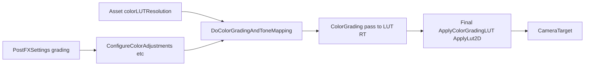

# Color Grading 场景

路径：`Assets/CustomSRP/Scenes/ColorGrading.unity`  
生成脚本：`Assets/CustomSRP/Editor/CreateColorGradingScene.cs`  
布局：`Assets/CustomSRP/Editor/ColorGradingSceneData/*.json`（同 HDR Tone Mapping Scene）  
Post FX：`Assets/CustomSRP/Settings/PostFXSettings.asset`（挂在 Pipeline Asset）  
LUT 分辨率：Pipeline Asset `colorLUTResolution`（16 / 32 / 64；本仓默认 32）

本场只验 **Color Grading + LUT + tone mapping**；勿串 Batcher / CSM / GI。  
Bloom 细节见 [post-processing.md](post-processing.md)；HDR 中间缓冲见 [hdr.md](hdr.md)。  
跨项目通用约定见 Skill [references/color-grading.md](../.cursor/skills/custom-srp/references/color-grading.md)（本文 = 本仓事实）。

## 当前状态

| 项 | 状态 |
|----|------|
| 场景（Tone Mapping 布局） | 已建；菜单可重建 |
| Color Adjustments / White Balance / Split Toning / Channel Mixer / SMH | **已接入** |
| Color LUT 烘焙 + Final 采样（`ApplyLut2D`） | **已接入** |
| Tone Mapping（None / ACES / Neutral / Reinhard）经 LUT | **已接入** |
| ACES tone map 时特定色彩空间 grading | **已接入** |
| Asset `colorLUTResolution` | **已接入** |

## 调用链



`PostFXSettings` + Asset `colorLUTResolution` → `PostFXStack.DoColorGradingAndToneMapping` → 配置 globals → 画 Color Grading LUT（宽 = res²，高 = res）→ `Final` 对源图 `ApplyLut2D` → CameraTarget。

Frame Debugger：看 **Color Grading \*** LUT RT 与 **Final**。HDR + 非 None tone mapping 时 LUT 走 Log C（`_ColorGradingLUTInLogC`）。

## 布局摘要

与 [HDR 场景](hdr.md) 相同：多档 Emission + 弱 Directional + Ambient 黑。布局数字以 `ColorGradingSceneData/*.json` 为准。

## 怎么打开 / 调参

1. 菜单 **CustomSRP → Create & Assign Pipeline Asset**。
2. 菜单 **CustomSRP → Create Color Grading Scene**。
3. 选中 `Settings/PostFXSettings`：调 Color Adjustments / White Balance / Split Toning / Channel Mixer / Shadows Midtones Highlights；Tone Mapping 默认 **Neutral**。
4. Pipeline Asset：调 `colorLUTResolution`（banding 明显时可升到 64）。
5. 强制重建：在 `ColorGradingSceneData/` 放空文件 `.force-rebuild` 后重载 Editor，或再跑菜单。

## 本仓核对 rg

```bash
# 层 1（本仓应命中 ColorGrading / ToneMapping / WhiteBalance / LUT 等）
rg -n "ColorGrading|ToneMapping|WhiteBalance|SplitToning|ChannelMixer|_ColorGradingLUT" Assets/CustomSRP

# 层 2（本仓已命中）
rg -n "DoColorGradingAndToneMapping|ApplyLut2D|GetLutStripValue|_ColorGradingLUT|ColorGrade|_ColorAdjustments|colorLUTResolution" Assets/CustomSRP
```

## 验收

- 默认 grading（白滤镜 / 0 曝光对比 / 单位 mixer）+ Neutral → 与仅 tone mapping 观感接近。
- Post Exposure ±2、Contrast ±50、Saturation ±100、Hue Shift 180° 可见。
- Temperature / Tint；Split Toning 冷阴影暖高光；SMH 分区上色。
- Frame Debugger：先画 LUT，再 Final；HDR + 非 None Tone Mapping 时 LUT 走 Log C。
- LUT 16 在强 HDR 渐变上易 banding；32 通常够用。
