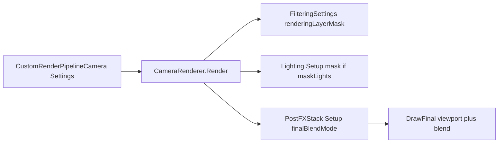

# Multiple Cameras 场景

路径：`Assets/CustomSRP/Scenes/MultipleCameras.unity`  
生成脚本：`Assets/CustomSRP/Editor/CreateMultipleCamerasScene.cs`  
菜单：**CustomSRP → Create Multiple Cameras Scene**  
Cold Post FX：`Assets/CustomSRP/Settings/PostFXSettingsCold.asset`（BR 相机 override）  
Glow Post FX：`Assets/CustomSRP/Settings/PostFXSettingsGlow.asset`（Overlay override）  
RT：`Assets/CustomSRP/Textures/MultipleCamerasRT.renderTexture`

本场只验 **多相机 viewport / final blend / Rendering Layer（几何+灯）/ 按相机 Post FX**；勿串 Batcher / CSM / GI。  
Bloom / grading 细节见 [post-processing.md](post-processing.md)、[color-grading.md](color-grading.md)。  
跨项目通用约定与排障见 Skill [references/multiple-cameras.md](../.cursor/skills/custom-srp/references/multiple-cameras.md)。

## 当前状态

| 项 | 状态 |
|----|------|
| 场景 + 菜单可重建 | **已接入**（2×2 + Overlay + RT Canvas） |
| `DrawFinal` + `SetViewport(pixelRect)` + Load/DontCare | **已接入**（`PostFXStack`） |
| `finalBlendMode` / `_FinalSrcBlend` / `_FinalDstBlend` | **已接入** |
| `CustomRenderPipelineCamera` + `CameraSettings` | **已接入** |
| `maskLights` + 相机 `renderingLayerMask` → 几何 FilteringSettings | **已接入** |
| 灯光 `renderingLayerMask` 上传（`DirectionsAndMasks` + `ReinterpretAsFloat`） | **已接入** |
| `GetFinalAlpha`（Lit/Unlit） | **已接入** |
| 按相机 override Post FX（含 null = 关 FX） | **已接入** |
| Bloom `downscaleLimit` 下限防护（避免 0×0 临时 RT） | **已接入** |
| Mesh Ball | **自动创建**（Instanced 默认 Layer 1；BR 仅 Layer4 会滤掉） |

## 调用链

每相机：读 `CameraSettings` → Cull →（可选）按 mask 过滤灯 → 几何 FilteringSettings → Post FX（可 override）→ `DrawFinal`。

## 布局摘要

| 相机 | Viewport | renderingLayerMask | 要点 |
|------|----------|--------------------|------|
| Main Camera Top Left | `(0, 0.5, 0.5, 0.5)` | Layer1\|Layer2 (`3`) | `maskLights`；全局 Post FX |
| Camera Top Right | `(0.5, 0.5, 0.5, 0.5)` | Layer1\|Layer3 (`5`) | `maskLights` |
| Camera Bottom Left | `(0, 0, 0.5, 0.5)` | Layer1\|Layer5\|Layer6 (`49`) | override Post FX = null（关 FX） |
| Camera Bottom Right | `(0.5, 0, 0.5, 0.5)` | Layer4 (`8`) | override Cold FX |
| Overlay Camera | `(0.375, 0.25, 0.25, 0.5)` | Layer5\|Layer7 (`80`) | Solid clear α=0；Glow FX；`One`/`OneMinusSrcAlpha` |
| Render Texture Camera | 全屏 → RT | Everything | Cold FX；Canvas RawImage 预览 |

灯光：Light A–D + Point/Spot 分属 Layer1–7。共享 MeshRenderer → Everything；`Emit_Overlay*` → Layer7；`Cube_Layer4` → Layer4。

## 怎么打开 / 调参

1. 菜单 **CustomSRP → Create & Assign Pipeline Asset**（若尚未挂管线）。
2. 菜单 **CustomSRP → Create Multiple Cameras Scene**（或打开已有场景）。
3. Game 视图：四角同视角不同灯/FX；中心 Overlay 预乘混合；左下角 RT RawImage。
4. 调相机上 `CustomRenderPipelineCamera`：`finalBlendMode`、`renderingLayerMask`、`maskLights`、`overridePostFX`。

## 本仓排障速查

通用根因见 Skill reference §4。本仓实例：

| 现象 | 本仓查 |
|------|--------|
| 某一角整屏无几何 | 该角 mask 是否滤掉默认 Layer1；物体是否 Everything |
| BR 看不到 Mesh Ball | 预期：Instanced 默认 Layer1，BR 仅 Layer4 |
| `GetTemporaryRT (width \|\| height <= 0)` | Cold/Glow 的 `bloom.downscaleLimit` 勿为 0 |
| Overlay 不透 / 黑底 | `finalBlendMode` 是否 `One`/`OneMinusSrcAlpha`；背景 α；Glow override |
| Overlay 仍吃全局 Bloom | Overlay 须 `overridePostFX` + Glow（或 null 关 FX） |

## 相关

- Skill：[references/multiple-cameras.md](../.cursor/skills/custom-srp/references/multiple-cameras.md)
- [Post Processing](post-processing.md) · [Color Grading](color-grading.md) · [排查](troubleshooting.md)
