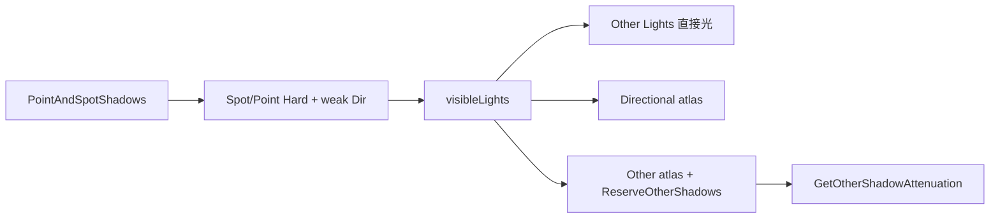

# Point and Spot Shadows 场景

路径：`Assets/CustomSRP/Scenes/PointAndSpotShadows.unity`  
生成脚本：`Assets/CustomSRP/Editor/CreatePointAndSpotShadowsScene.cs`  
布局数据：`Assets/CustomSRP/Editor/PointAndSpotShadowsSceneData/`（`objects.json` / `lights.json` / `meta.json`）

跨项目约定：Skill [`references/point-and-spot-shadows.md`](../.cursor/skills/custom-srp/references/point-and-spot-shadows.md)

主循环顺序见 [渲染循环](render-loop.md)。方向光阴影见 [DirectionalShadows](directional-shadows.md)；Other 直接光见 Skill references `point-and-spot-lights`。

## 场景是干什么的

验收 **Point / Spot 实时阴影**（第二 atlas、透视投影、tile 预算）。布局以本仓 JSON / 生成脚本为准。

它**不是** Many Lights 衰减场（[`PointAndSpotLights`](../Assets/CustomSRP/Scenes/PointAndSpotLights.unity)），也**不是** CSM 场（[DirectionalShadows](directional-shadows.md)）。

| 你期望看到 / 验证 | 对应能力 |
|-------------------|----------|
| Spot 锥内投影 | 透视 shadow map，1 tile / 灯 |
| Point 全向影 | 立方体面，6 tile / 灯 |
| Clip / Transparent 更实心影 | Cast Shadows = Two Sided |
| Pancaking Cubes | 透视下关 pancaking（`_ShadowPancaking`） |

## 本仓接线进度（已核验）



| 项 | 本仓结果 |
|----|----------|
| Other Lights 直接光 | **已接** |
| Other 实时阴影 | **已接**（`ReserveOtherShadows` / `RenderOtherShadows` / `_OtherShadowAtlas` / `GetOtherShadowAttenuation` / `_ShadowPancaking`） |
| Directional 阴影 | 已有（见 Directional Shadows） |
| Filter | 与方向光共用 `filterQuality`（`_SHADOW_FILTER_*`），无独立 `_OTHER_PCF*` |
| Shadow mask 混合 | 未接 |

## 怎么打开 / 重建

1. 挂管线：菜单 **CustomSRP → Create & Assign Pipeline Asset**（已挂可跳过）。
2. 打开或重建：菜单 **CustomSRP → Create Point and Spot Shadows Scene** → `Assets/CustomSRP/Scenes/PointAndSpotShadows.unity`（加入 Build Settings，不抢第一位）。
3. Asset → Shadows → **Other → Atlas Size**（默认 1024）。
4. 强制重建：在 `PointAndSpotShadowsSceneData/` 下放置空文件 `.force-rebuild` 后让 Editor 重载，或再跑菜单。

## 场景里有什么

以生成脚本 + JSON 为准：

| 分组 | 内容 |
|------|------|
| Plane | 地面（Opaque） |
| Metallic Smoothness Grid | M/S 球（Transparent 材质 + MPB） |
| Pancaking Cubes | 高处 Cube（验透视 pancaking） |
| Varied Objects | 杂色 Sphere / Cube（含 Clip） |
| Mesh Ball | Play 可见 `DrawMeshInstanced` |
| Lights | 弱 Directional ×4 + Spot ×6 + Point ×6，**全部 Hard 阴影**（`lights.json`） |

Clip / Transparent：`castShadows = TwoSided`（JSON / 生成脚本）。

### vs PointAndSpotLights

| | PointAndSpotLights | PointAndSpotShadows |
|--|--------------------|---------------------|
| 菜单 | Create Point and Spot Lights Scene | Create Point and Spot Shadows Scene |
| 用途 | 多光衰减 / Forward+ | Other **阴影**验收 |
| 灯阴影 | 多数 None（仅弱 Directional Soft） | Spot/Point/Dir **全 Hard** |

## 概念对照

与方向光：**共用 ShadowCaster**；Other 用第二 atlas + 透视；无 cascade。Spot 1 tile、Point 6 tile；上限 `MaxShadowedOtherLightCount = 16`。PCF 走统一 `filterQuality`。

## 排障（本仓）

| 现象 | 查 |
|------|----|
| Spot/Point 有光无影 | Type/Strength；tile 是否用尽（Point×6）；bounds；maxDistance；Frame Debugger Other atlas |
| tile 边缘串影 | tile clamp / border |
| 点光面缝 / 漏光 | FOV bias；view 翻转；Normal Bias；Two Sided |
| 长物体近光扭曲 | pancaking 未关（Other 应 `_ShadowPancaking=0`） |
| 只有方向影 | Other atlas 是否渲染；Point 是否超 tile 预算 |

## 相关核对

```bash
rg -n 'ReserveOtherShadows|RenderOtherShadows|_OtherShadowAtlas|GetOtherShadowAttenuation|ShadowPancaking|CubeMapFaceID|ComputeSpotShadow|ComputePointShadow' \
  Assets/CustomSRP --glob '*.cs' --glob '*.hlsl' --glob '*.shader'
```

## 相关代码

| 路径 | 职责 |
|------|------|
| `Runtime/Shadows.cs` | Reserve / Build / Render Other；CullShadowCasters |
| `Runtime/ShadowSettings.cs` | `other.atlasSize` |
| `Runtime/Passes/LightingPass.cs` | `ReserveOtherShadows` 写入 light shadowData |
| `ShaderLibrary/Shadows.hlsl` | `GetOtherShadowAttenuation` / PCF / tile clamp |
| `ShaderLibrary/Light.hlsl` | Other 阴影乘进 attenuation |
| `Shaders/ShadowCasterPass.hlsl` | `_ShadowPancaking` |

## 验收

- [ ] Spot / Point Hard 影可见；关灯影消
- [ ] Frame Debugger 出现 Other Shadow Atlas
- [ ] Point 占 6 tile、Spot 占 1；超限无实时影可解释
- [ ] 透视下无 pancaking 扭曲
- [ ] 未另起独立 ShadowCaster
